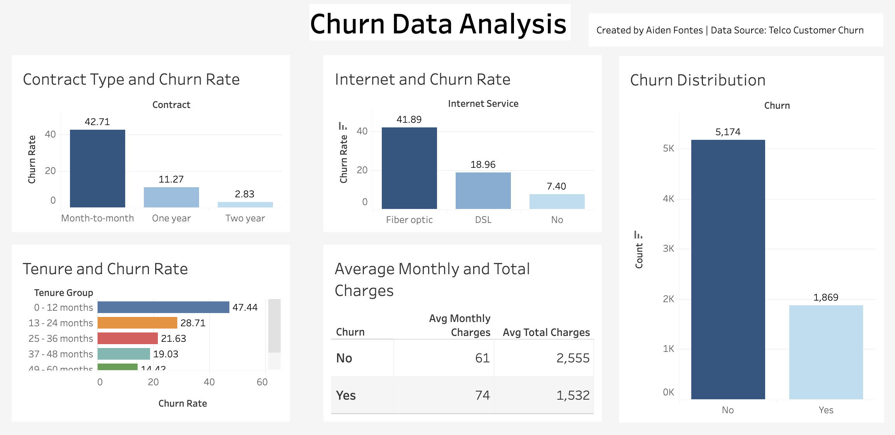

# 📉 **Customer Churn Analysis & Prediction**  

  
  
  

### **Exploratory & Predictive analysis of telecom customer churn to identify at-risk segments and provide actionable recommendations for retention.**

---

## **📑 Table of Contents**  
1. [Project Overview](#-project-overview)  
2. [Business Problem](#-business-problem)  
3. [Dataset](#-dataset)  
4. [Process](#-process)  
5. [Key Insights & Actions](#-key-insights--actions)  
6. [Predictive Modeling](#-predictive-modeling)  
7. [Visualizations](#-visualizations)  
8. [Tools Used](#-tools-used)  
9. [Future Work](#-future-work)  
10. [Author](#-author)  

---

## **📌 Project Overview**  
Telecom providers face high **customer churn** rates, especially among **month-to-month subscribers and high-cost service users**.  
This project analyzes **Telco customer churn data** to:  
- Identify **which customer segments are most likely to churn**.  
- Build a **predictive model** to flag at-risk customers.  
- Provide **data-driven retention strategies**.  

**Framework:** Google Data Analytics 6-step process:  
> **Ask → Prepare → Process → Analyze → Share → Act**  

---

## **🎯 Business Problem**  
**Key Questions:**  
1. Which customer segments have the highest churn rates?  
2. How do **contract type**, **internet service**, and **charges** affect churn?  
3. Can we **predict churn** with reasonable accuracy to take preventive action?  

**Stakeholders:**  
- **Marketing & Retention Teams** – Need insights to develop offers for at-risk customers.  
- **Product & Operations Teams** – Require understanding of pain points leading to churn.  

---

## **📂 Dataset**  
- **Source:** [Telco Customer Churn Dataset (Kaggle)](https://www.kaggle.com/datasets/blastchar/telco-customer-churn)  
- **Size:** 7,043 customers, 21 features.  
- **Key columns:**  
  - `Churn` – Target variable (Yes/No).  
  - `Contract` – Month-to-month, 1-year, or 2-year contracts.  
  - `InternetService` – DSL, Fiber optic, None.  
  - `MonthlyCharges`, `TotalCharges`.  
  - `tenure` – Customer tenure in months.  

---

## **🛠 Process**  

### 1. **Data Cleaning & Preparation**  
- Converted `TotalCharges` to numeric and handled missing values.  
- Created **tenure groups** for better segmentation.  
- Encoded categorical variables for modeling.  

### 2. **Exploratory Analysis (SQL & Python)**  
- **Churn breakdown** by contract, internet type, charges, and tenure.  
- Identified **high-churn segments** (month-to-month contracts, fiber optic users, high monthly charges).  

### 3. **Predictive Modeling**  
- Built a **Logistic Regression model** using Scikit-learn.  
- Evaluated using **precision, recall, and F1-score**.  

### 4. **Interactive Dashboard**  
- Created a **Tableau dashboard** for dynamic exploration of churn metrics.  

---

## **🔑 Key Insights & Actions**  

### 1. **Month-to-month customers churn the most (42%).**  
> **Action:** Incentivize upgrades to **1–2 year contracts** with discounts and loyalty perks.  

### 2. **Fiber optic customers have higher churn (41%).**  
> **Action:** Investigate service quality issues and **offer targeted retention deals** for fiber users.  

### 3. **High monthly charges correlate with higher churn.**  
> **Action:** Introduce **tiered pricing options** and **discount bundles** to reduce churn in high-paying customers.  

### 4. **Tenure < 1 year customers are at greatest risk.**  
> **Action:** Launch **onboarding & engagement programs** for new customers to build loyalty early.  

---

## **🤖 Predictive Modeling**  

**Model:** Logistic Regression (Scikit-learn).  

**Performance:**  
- **Accuracy:** ~79%.  
- **Churn Precision:** 69% (when flagged, 69% of predicted churners are correct).  
- **Churn Recall:** 57% (model detects 57% of actual churners).  

> **Interpretation:** The model performs well in predicting non-churners but **needs improvement for recall of churners**.  

---

## **📊 Visualizations**  
- **Churn Distribution** (Pie & Bar).  
- **Churn by Contract Type** (Bar chart).  
- **Churn by Internet Service** (Stacked bar).  
- **Boxplot:** Monthly Charges vs Churn.  
- **Tenure Group Analysis.**  
- **Interactive Tableau Dashboard** ([View Here](https://public.tableau.com/app/profile/aiden.fontes/viz/ChurnAnalysis_17539352623890/Dashboard3?publish=yes&showOnboarding=true))  

  

---

## **🧰 Tools Used**  
- **SQL:** Querying & aggregations for churn insights.  
- **Python:** Pandas, Seaborn, Matplotlib, Scikit-learn for modeling.  
- **Tableau:** Interactive dashboard for stakeholders.  

---

## **🔮 Future Work**  
- Experiment with **Random Forest & XGBoost** to improve churn prediction.  
- **Feature engineering** (e.g., interaction terms, derived metrics).  
- **Customer segmentation** (clustering) for personalized retention strategies.  

---

## **👤 Author**  
**Aiden Fontes**  
*Data Analyst | Python | SQL | Tableau*  

  
  
