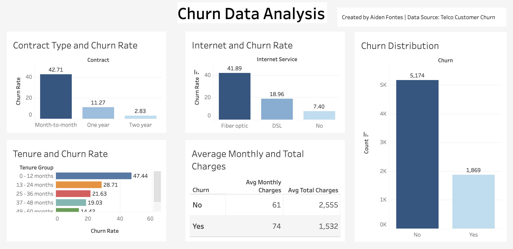

# Customer Churn Analysis & Prediction
An end-to-end analysis of customer churn for a telecommunications company using **SQL**, **Python**, and **Tableau**.

## Project Goals
- Identify key factors contributing to customer churn.
- Build a predictive model to classify at-risk customers.
- Create an interactive dashboard for stakeholders.

## Tools Used
- **SQL:** For data exploration and aggregation.
- **Python:** For cleaning, analysis, and modeling.
- **Tableau:** For interactive dashboarding.

## Key Insights
- Month-to-month customers have the highest churn rates.
- Customers with fiber optic internet churn more than DSL users.
- Higher monthly charges correlate with higher churn likelihood.

## Deliverables
- [Jupyter Notebook Report](churn_data_project.ipynb)
- [Tableau Dashboard](https://public.tableau.com/app/profile/aiden.fontes/viz/ChurnAnalysis_17539352623890/Dashboard3?publish=yes&showOnboarding=true#WelcomeQuestionnaire)  
- [SQL Queries](SQL/churn_queries.sql)

## Preview

---
*Author: Aiden Fontes*
